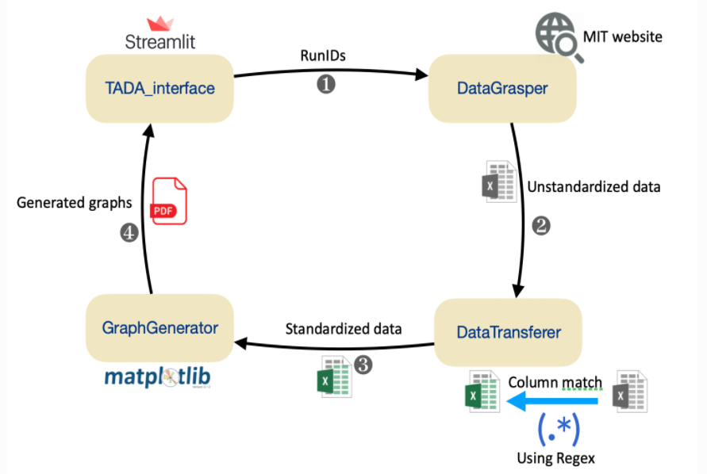

# Thc Automated Display Analysis

tada is a tool for CAL FAS internal use only. it is build to visualize and aggregate the FEA result.

see details in : https://wangchen9.github.io/tada/

-----

## Installation

TADA is build on [ streamlit](https://streamlit.io/).

To run tada locally, first create a conda environment, using 

```python
conda create --name tada python=3.8
conda activate tada
```

 the requirement file is located at the source directory. You can install all required packages by using pip install like so:

```python
pip install -r requirements.txt
```

to open streamlit , use :

```python
streamlit run src/code/TADA_interface.py
```

## Human-Computer interaction Procedure

1. StInterface displays user interface
2. User inputs all RunIDs and click **« Search »** button
3. Datagrasper grasps information from MIT website and generate a unstandardized excel
4. DataTransferer reads the unstandardized excel and transfer their column names to standardized ones, and generates a standardized excel
5. User selects graphs options and click the button **« Generate graphs »**
6. GraphGenerator reads the standardized excel and generates graphs in a PDF, finally it sends figure objects to StInterface
7. StInterface receives the figure objects and displays them on the user interface



---

