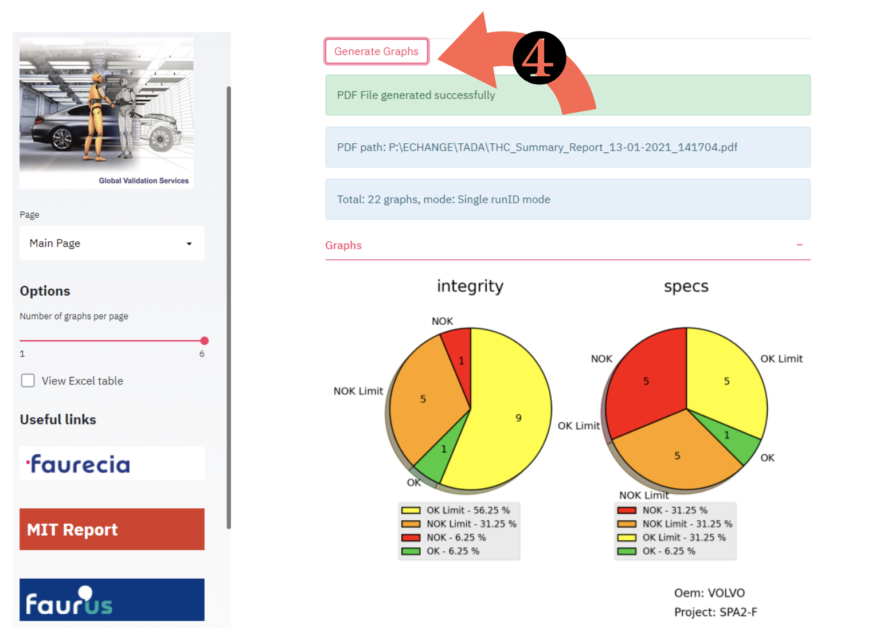
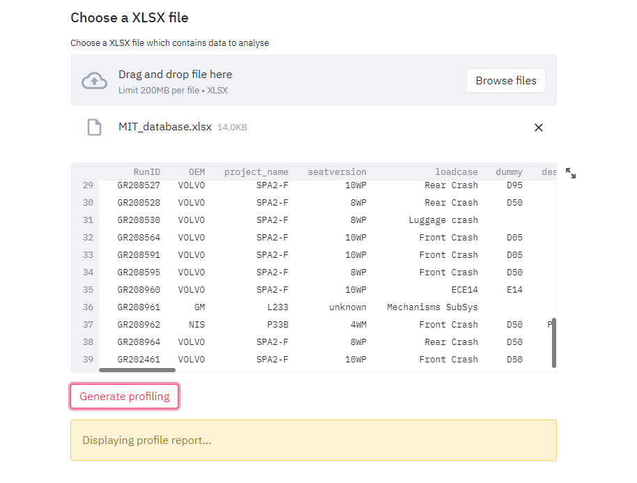
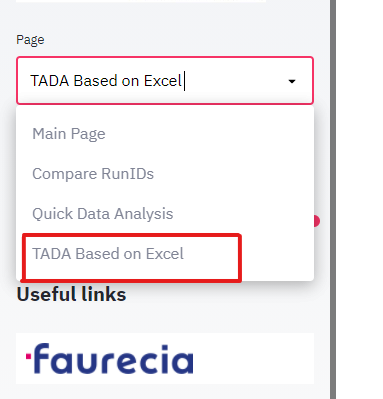

.. TADA documentation master file, created by
   sphinx-quickstart on Thu Jan 14 10:13:07 2021.
   You can adapt this file completely to your liking, but it should at least
   contain the root `toctree` directive.

TADA Quick start 
======================

1. Double click the file **« TADA_runner.bat »** in the source directory, a web page will be opened.

.. image:: pic/userguide1.png
   :align: center
   :alt: User guide image
   :width: 630

2. Click **« Browse files »** to select one or multiple txt files which contains RunIDs.

.. image:: pic/userguide2.png
   :align: center
   :alt: User guide image
   :width: 630

3. You may also want to add other RunIDs. You can do it by entering them in the text input below and then click **« Add to list »**. 
4. All selected RunIDs will be presented at the bottom. 
5. Click the button **« Search »** and wait for a while. During this time, the program searches all the RunID one by one from MIT reports online database. The search time depends on the total number of RunID and connection speed.

.. image:: pic/userguide3.png
   :align: center
   :alt: User guide image
   :width: 630

6. Then, you can select the design loops or different types of graph in the expander sections. 

.. image:: pic/userguide4.png
   :align: center
   :alt: User guide image
   :width: 630

.. tip::
   If multiple design loops are selected, the generated graphs will be in compare mode. The generated graph will compare results in different **design loops** instead of load case short name.

7. Click **« Generate Graphs »**. All generated graphs will be displayed in the section « Graphs ». A PDF file which contains all graphs will be generated at the same time. 

8. You can see the standardized Excel table, by clicking the checkbox **« View Excel table »** in the sidebar. A table will be displayed on the interface.

.. image:: pic/userguide6.png
   :align: center
   :alt: User guide image
   :width: 630

.. seealso:: Demo video: Main Page - TADA

.. raw:: html

   <video src="_static/streamlit-TADA_interface-main_page.webm" width="100%" controls="controls">Can not load the video</video>

   

.. tip:: 
   Sometimes, you just want to compare **compare different RunIDs**. To do this, you can switch the « Page » in the sidebar, and select **« Compare RunIDs »**, then click **« Generate Graphs »**.

.. image:: pic/userguide7.png
   :align: center
   :alt: User guide image
   :width: 630

.. seealso:: Demo video: Compare RunIDs

.. raw:: html

   <video src="_static/streamlit-TADA_interface-compare_runids.webm" width="100%" controls="controls">Can not load the video</video>

   

Quick Data Analysis
=========================
If you want to do some data analysis, you can use the « Quick Data Analysis »:

- First, switch the **« Page »** option to **« Quick Data Analysis »**

.. image:: pic/analysis1.png
   :align: center
   :alt: User guide image
   :width: 630

- Then, select a XLSX file which contains the data to be analyzed.

.. image:: pic/analysis2.png
   :align: center
   :alt: User guide image
   :width: 630

.. image:: pic/profiling1.png
   :align: center
   :alt: User guide image
   :width: 630

- Finally, click **« Generate profiling »** to generate an interactive HTML report.

For each column the following statistics - if relevant for the column type - are presented in an interactive HTML report:

* **Type inference**: detect the types of columns in a dataframe.
* **Essentials**: type, unique values, missing values
* **Quantile statistics** like minimum value, Q1, median, Q3, maximum, range, interquartile range
* **Descriptive statistics** like mean, mode, standard deviation, sum, median absolute deviation, coefficient of variation, kurtosis, skewness
* **Most frequent values**
* **Histograms**
* **Correlations** highlighting of highly correlated variables, Spearman, Pearson and Kendall matrices
* **Missing values** matrix, count, heatmap and dendrogram of missing values
* **Duplicate rows** Lists the most occurring duplicate rows
* **Text analysis** learn about categories (Uppercase, Space), scripts (Latin, Cyrillic) and blocks (ASCII) of text data

Results could be like this:

.. image:: pic/profiling2.png
   :align: center
   :alt: User guide image
   :width: 630

.. image:: pic/profiling3.png
   :align: center
   :alt: User guide image
   :width: 630

.. seealso:: Demo video: Quick data analysis

.. raw:: html

   <video src="_static/streamlit-TADA_interface-data_analysis.webm" width="100%" controls="controls">Can not load the video</video>

TADA Based on Excel
=====================
You can also update an existing Excel by adding other RunIDs. If you have already deleted the unnecessary columns in your Excel table, 
and you want to add a few other RunIDs to the existing table without creating new tables.

To do this, switch to **« TADA Based on Excel »** page in the sidebar. 

Then, upload the existing Excel with desired columns. 
You can then see the Excel table on your screen.

.. image:: pic/based_on_excel2.png
   :align: center
   :alt: User guide image
   :width: 630

Now, enter a few RunIDs to the input box and click **« Add to list »**. Finally, click **« Search »**. The updated Excel will be generated and stored to the same path of other generated files.

.. image:: pic/based_on_excel3.png
   :align: center
   :alt: User guide image
   :width: 630

.. seealso:: Demo video:  Add RunID based on Excel

.. raw:: html

   <video src="_static/streamlit-TADA_interface-TADA_based_on_excel.webm" width="100%" controls="controls">Can not load the video</video>
